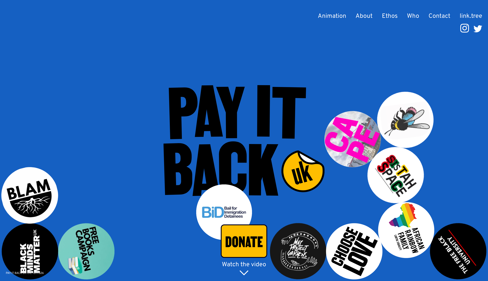
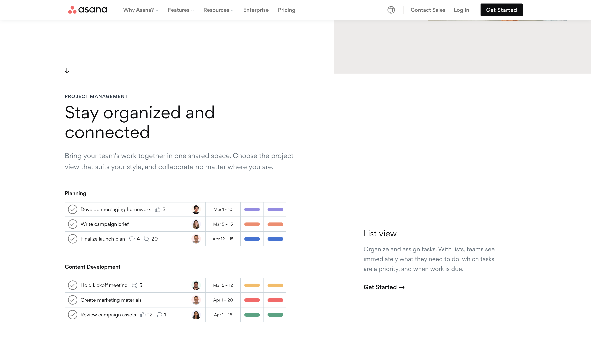

# frontend

Replicate Frontend Designs of stunning websites

# Finds

- [Wonder](https://www.wonder.me/)

Wonder is a virtual space where people can meet and talk.
Online gatherings that are [fun || social || better].

---

- [Superpeer](https://superpeer.com/)

A video platform for the world’s leading minds.
Superpeer gives you the tools you need to have paid 1:1 video calls and livestreams with your audience and paid subscribers.

---

- [The Clearleft Podcast](https://podcast.clearleft.com/)

The Clearleft Podcast: We talk to peers, clients, and customers. Then we share what we learn about the challenges and rewards of digital design.

---

- [Aptean](https://www.aptean.com/)

Aptean delivers mission-critical enterprise software, tailored to your industry's needs.

---

- [Hackathon Club Bank](https://hackclub.com/bank/)

Hackathon Club Bank is a place for creatives and creators to make ideas real.
Running world-class hackathons - Open to all US-based registered Hack Clubs, hackathons, and your next amazing project.

---

- [Pay it Back UK](https://payitback.uk/#home)

An interactive/animated donation website

---

- [Asana](https://asana.com/)

Manage your team’s work, projects, & tasks online • Asana

---

- [More finds]() - Go here

## Tools (Vanilla/React/Vue)

- HTML, CSS, JavaScript (ES6+)

- [Create React App](https://github.com/facebook/create-react-app/)

# Demos (Completed build/links)

- [Clearleft Podcast]((https://frontend-clearleftpodcast.surge.sh/)
-
